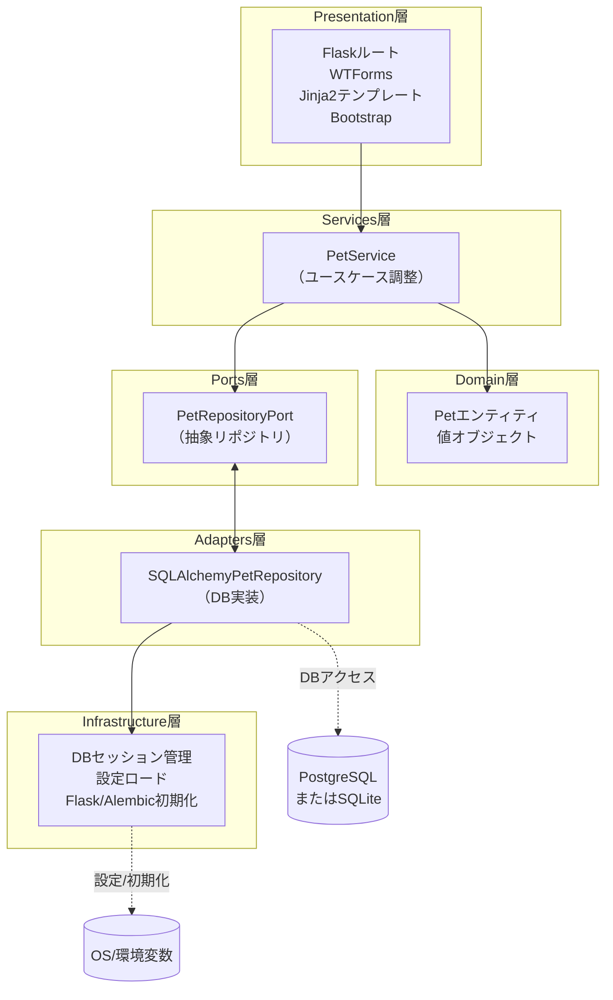

# 技術スタック構成図（Pet Catalog）

---

## レイヤ対応ディレクトリ

| レイヤ             | フォルダ                  | 主な責務例                       |
|--------------------|---------------------------|----------------------------------|
| Presentation       | `app/presentation/`       | Flaskルート・WTForms・テンプレート|
| Services           | `app/services/`           | ユースケース調整・トランザクション|
| Domain             | `app/domain/`             | エンティティ・値オブジェクト      |
| Ports              | `app/ports/`              | 抽象リポジトリ                   |
| Adapters           | `app/adapters/`           | DB実装・外部APIクライアント      |
| Infrastructure     | `app/infrastructure/`     | DBセッション管理・
