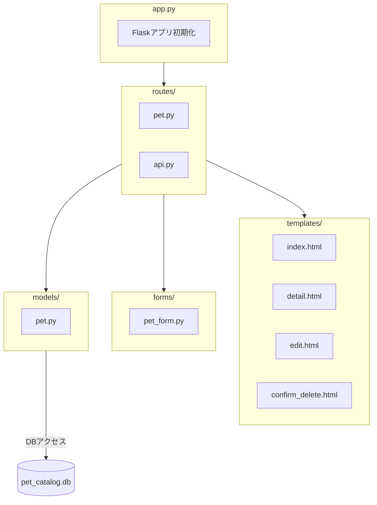

# 実態ベース技術構成図（Pet Catalog: 現行構成）

---

## ディレクトリ対応表（現状）

| 機能         | フォルダ/ファイル           | 主な責務例                       |
|--------------|----------------------------|----------------------------------|
| アプリ初期化 | `app.py`                   | Flaskアプリ・DB初期化            |
| ルーティング | `routes/pet.py`            | CRUDルート                       |
| API          | `routes/api.py`            | REST APIルート                   |
| モデル       | `models/pet.py`            | Petエンティティ(DB依存)           |
| フォーム     | `forms/pet_form.py`        | 入力バリデーション                |
| テンプレート | `templates/*.html`         | 画面UI                           |
| DB           | `pet_catalog.db`           | SQLiteデータベース                |

---

### 備考
- サービス層・ポート層・アダプタ層・インフラ層は現状未分離
- シンプルなMVC+API構成
- DBはSQLiteファイルを直接参照
