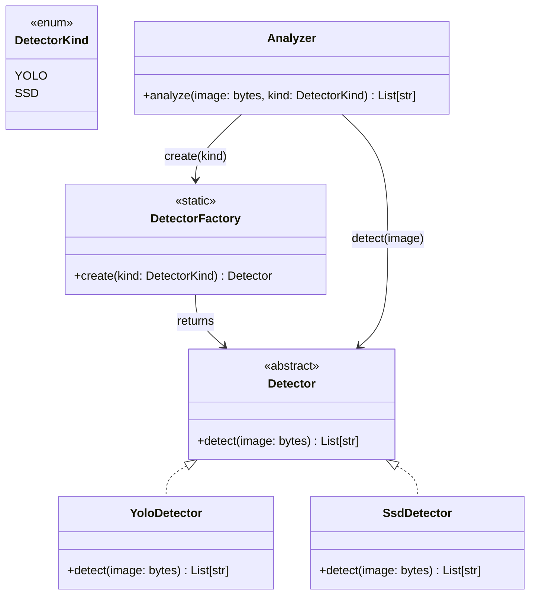
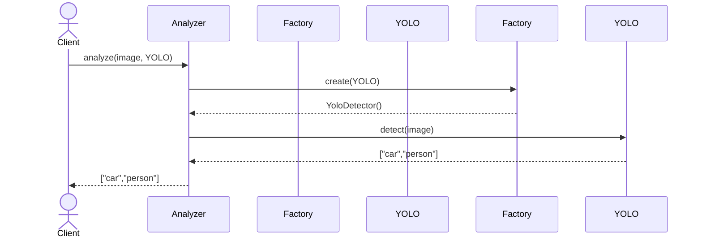
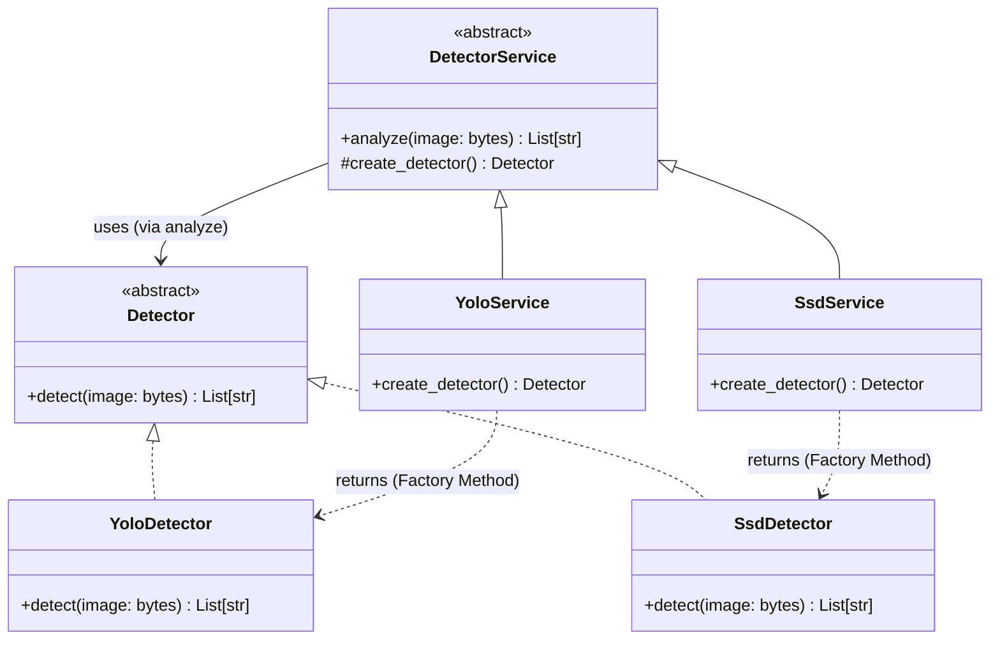
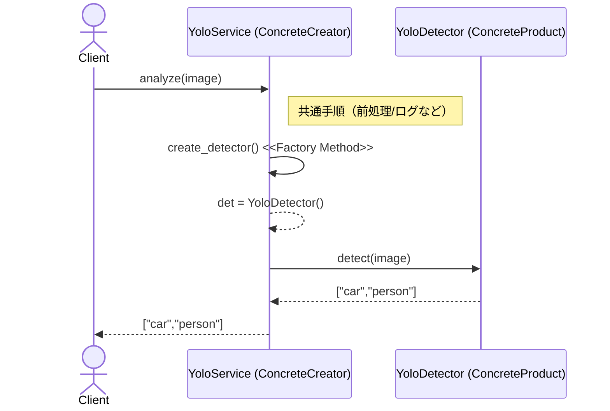

```mermaid
classDiagram
    class Detector {
      <<abstract>>
      +detect(image: bytes) List[str]
    }

    class YoloDetector {
      +detect(image: bytes) List[str]
    }

    class SsdDetector {
      +detect(image: bytes) List[str]
    }

    class DetectorFactory {
      <<static>>
      +create(kind: DetectorKind) Detector
    }

    class DetectorKind {
      <<enum>>
      YOLO
      SSD
    }

    class Analyzer {
      +analyze(image: bytes, kind: DetectorKind) List[str]
    }

    Detector <|.. YoloDetector
    Detector <|.. SsdDetector
    Analyzer --> DetectorFactory : create(kind)
    DetectorFactory --> Detector : returns
    Analyzer --> Detector : detect(image)
```

-----

```mermaid
sequenceDiagram
    actor Client
    participant Analyzer
    participant DetectorFactory as Factory
    participant YoloDetector as YOLO

    Client->>Analyzer: analyze(image, YOLO)
    Analyzer->>Factory: create(YOLO)
    Factory-->>Analyzer: YoloDetector()
    Analyzer->>YOLO: detect(image)
    YOLO-->>Analyzer: ["car","person"]
    Analyzer-->>Client: ["car","person"]
```

---

```mermaid
classDiagram
    class Detector {
      <<abstract>>
      +detect(image: bytes) List[str]
    }

    class YoloDetector {
      +detect(image: bytes) List[str]
    }

    class SsdDetector {
      +detect(image: bytes) List[str]
    }

    class DetectorService {
      <<abstract>>
      +analyze(image: bytes) List[str]
      #create_detector() Detector
    }

    class YoloService {
      +create_detector() Detector
    }

    class SsdService {
      +create_detector() Detector
    }

    Detector <|.. YoloDetector
    Detector <|.. SsdDetector

    DetectorService <|-- YoloService
    DetectorService <|-- SsdService

    DetectorService --> Detector : uses (via analyze)
    YoloService ..> YoloDetector : returns (Factory Method)
    SsdService ..> SsdDetector : returns (Factory Method)
```

---

```mermaid
sequenceDiagram
    actor Client
    participant YoloService as YoloService (ConcreteCreator)
    participant YOLO as YoloDetector (ConcreteProduct)

    Client->>YoloService: analyze(image)
    Note right of YoloService: 共通手順（前処理/ログなど）
    YoloService->>YoloService: create_detector()  <<Factory Method>>
    YoloService-->>YoloService: det = YoloDetector()
    YoloService->>YOLO: detect(image)
    YOLO-->>YoloService: ["car","person"]
    YoloService-->>Client: ["car","person"]
```
