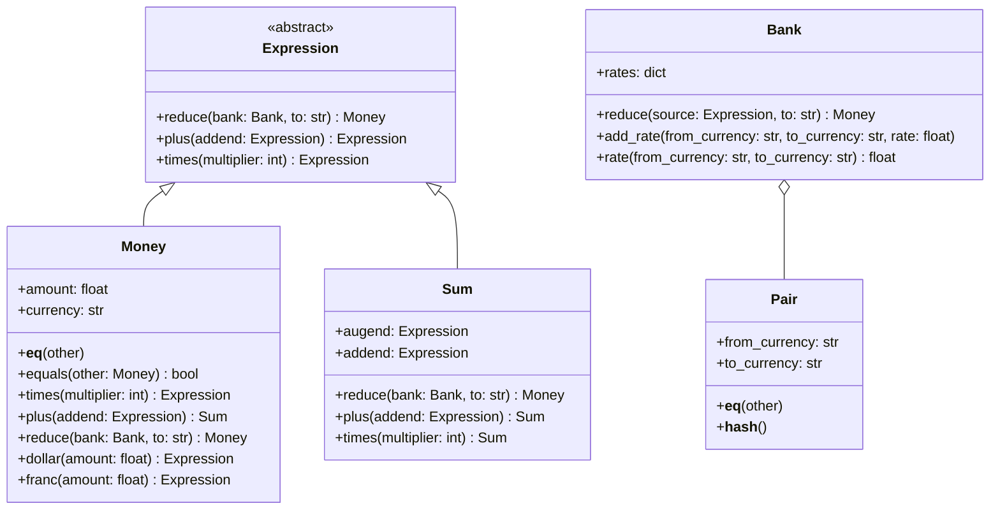

```mermaid
classDiagram
    class Expression {
        <<abstract>>
        +reduce(bank: Bank, to: str) Money
        +plus(addend: Expression) Expression
        +times(multiplier: int) Expression
    }

    class Money {
        +amount: float
        +currency: str
        +__eq__(other)
        +equals(other: Money) bool
        +times(multiplier: int) Expression
        +plus(addend: Expression) Sum
        +reduce(bank: Bank, to: str) Money
        +dollar(amount: float) Expression
        +franc(amount: float) Expression
    }

    class Sum {
        +augend: Expression
        +addend: Expression
        +reduce(bank: Bank, to: str) Money
        +plus(addend: Expression) Sum
        +times(multiplier: int) Sum
    }

    class Bank {
        +rates: dict
        +reduce(source: Expression, to: str) Money
        +add_rate(from_currency: str, to_currency: str, rate: float)
        +rate(from_currency: str, to_currency: str) float
    }

    class Pair {
        +from_currency: str
        +to_currency: str
        +__eq__(other)
        +__hash__()
    }

    Expression <|-- Money
    Expression <|-- Sum
    Bank o-- Pair
```