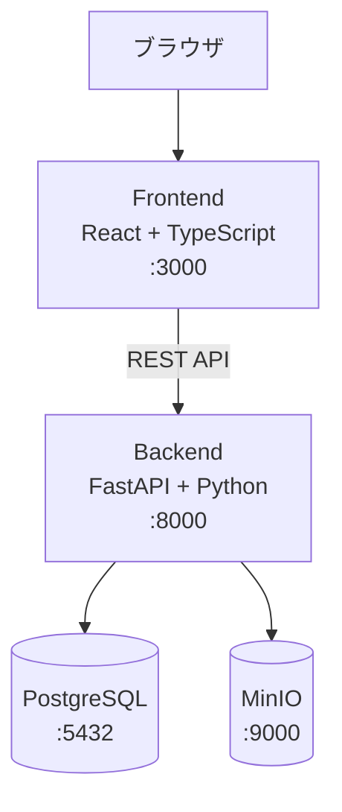
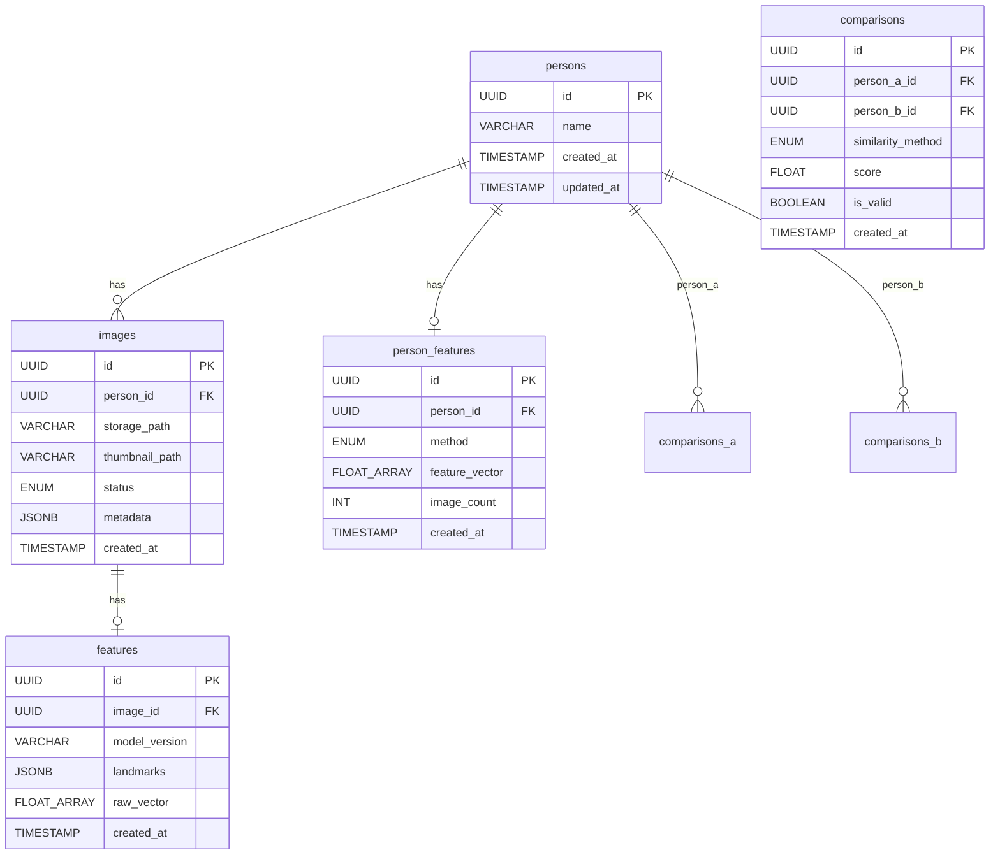
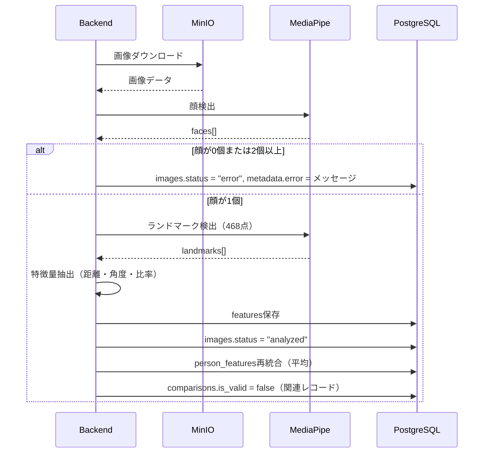
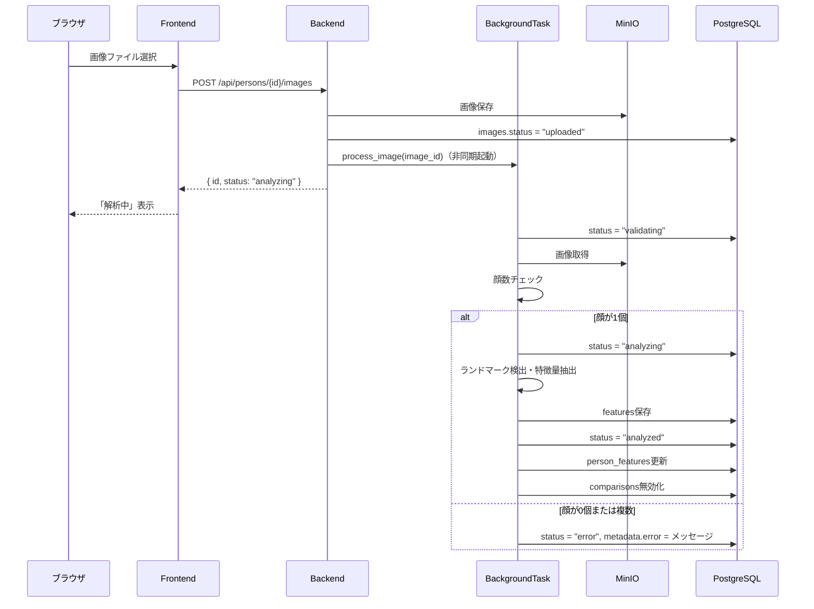
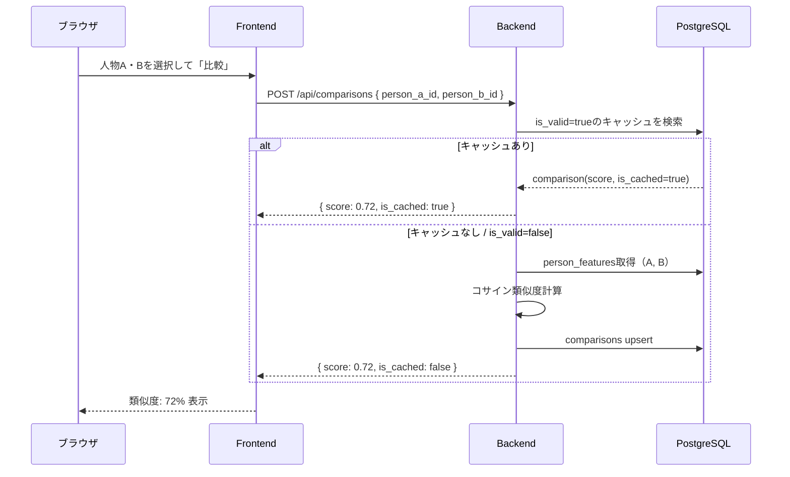
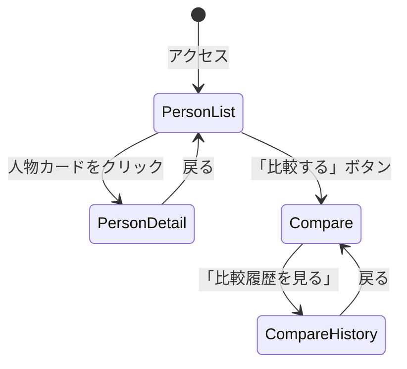

# 機能設計書 (Functional Design Document)

**バージョン**: 1.0
**作成日**: 2026-03-20
**プロジェクト**: FaceGraph

---

## システム構成図



### コンテナ構成

| コンテナ | イメージ / ビルド | ポート | 役割 |
|----------|------------------|--------|------|
| frontend | `./frontend` (Node) | 3000 | React SPA |
| backend | `./backend` (Python) | 8000 | FastAPI REST API + 解析エンジン |
| postgres | `postgres:16` | 5432 | メインDB |
| minio | `minio/minio` | 9000 / 9001 | 画像オブジェクトストレージ |

---

## 技術スタック

| 分類 | 技術 | 選定理由 |
|------|------|----------|
| フロントエンド | React + TypeScript | 型安全なコンポーネント開発 |
| バックエンド | FastAPI (Python 3.11) | 非同期処理・画像解析ライブラリとの親和性 |
| データベース | PostgreSQL 16 | JSONB型で特徴量ベクトルを柔軟に保存 |
| オブジェクトストレージ | MinIO | S3互換・Docker完結 |
| 顔ランドマーク検出 | MediaPipe Face Mesh | GPU不要・468点・正面顔で数十ms |
| 数値計算 | NumPy + SciPy | コサイン類似度・将来のProcrustes解析 |
| コンテナ管理 | Docker Compose | 4コンテナ一括管理 |
| ORM | SQLAlchemy (async) | PostgreSQL非同期アクセス |
| マイグレーション | Alembic | DBスキーマ管理 |

---

## データモデル定義

### ER図



### テーブル定義

#### persons（人物）

| カラム | 型 | 制約 | 説明 |
|--------|----|------|------|
| id | UUID | PK, default gen_random_uuid() | 主キー |
| name | VARCHAR(100) | NOT NULL | 表示名 |
| created_at | TIMESTAMP | NOT NULL, default now() | 作成日時 |
| updated_at | TIMESTAMP | NOT NULL, default now() | 更新日時 |

#### images（画像）

| カラム | 型 | 制約 | 説明 |
|--------|----|------|------|
| id | UUID | PK | 主キー |
| person_id | UUID | FK → persons, CASCADE | 所属人物 |
| storage_path | VARCHAR(500) | NOT NULL | MinIO上のオブジェクトパス |
| thumbnail_path | VARCHAR(500) | | サムネイルパス |
| status | ENUM | NOT NULL | `uploaded / validating / analyzing / analyzed / error` |
| metadata | JSONB | default `{}` | エラー理由等 |
| created_at | TIMESTAMP | NOT NULL | 作成日時 |

**ステータス遷移**:
```
uploaded → validating → analyzing → analyzed
                  ↘ error（顔0個 / 複数顔 / 解析失敗）
```

#### features（画像単位の特徴量）

| カラム | 型 | 制約 | 説明 |
|--------|----|------|------|
| id | UUID | PK | 主キー |
| image_id | UUID | FK → images, UNIQUE | 1画像につき1レコード |
| model_version | VARCHAR(50) | NOT NULL | 例: `mediapipe_v0.10` |
| landmarks | JSONB | NOT NULL | 468点のランドマーク座標 (x, y, z) |
| raw_vector | FLOAT[] | NOT NULL | 正規化済み特徴量ベクトル |
| created_at | TIMESTAMP | NOT NULL | 作成日時 |

#### person_features（人物単位の統合特徴量）

| カラム | 型 | 制約 | 説明 |
|--------|----|------|------|
| id | UUID | PK | 主キー |
| person_id | UUID | FK → persons, UNIQUE | 1人物につき1レコード |
| method | ENUM | NOT NULL | `average / single / median` |
| feature_vector | FLOAT[] | NOT NULL | 統合済み特徴量ベクトル |
| image_count | INT | NOT NULL | 統合に使用した画像数 |
| created_at | TIMESTAMP | NOT NULL | 作成日時 |

#### comparisons（比較結果キャッシュ）

| カラム | 型 | 制約 | 説明 |
|--------|----|------|------|
| id | UUID | PK | 主キー |
| person_a_id | UUID | FK → persons | 比較対象A |
| person_b_id | UUID | FK → persons | 比較対象B |
| similarity_method | ENUM | NOT NULL | `cosine / euclidean / procrustes` |
| score | FLOAT | NOT NULL | 0.0〜1.0 |
| is_valid | BOOLEAN | NOT NULL, default true | 画像変更時にfalse |
| created_at | TIMESTAMP | NOT NULL | 作成日時 |

**制約**: UNIQUE(person_a_id, person_b_id, similarity_method)

---

## コンポーネント設計

### バックエンドレイヤー構成

```
app/
├── main.py                  # FastAPIエントリポイント・ルーター登録
├── config.py                # 設定（環境変数・config.yml）
├── models/                  # SQLAlchemy ORM定義
│   ├── person.py
│   ├── image.py
│   ├── feature.py
│   └── comparison.py
├── routers/                 # APIエンドポイント
│   ├── persons.py
│   ├── images.py
│   └── comparisons.py
├── services/                # ビジネスロジック
│   ├── person_service.py
│   ├── image_service.py
│   ├── comparison_service.py
│   └── analysis/            # 解析パイプライン
│       ├── pipeline.py
│       ├── detectors/       # Strategy: ランドマーク検出
│       │   ├── base.py      # Protocol定義
│       │   └── mediapipe.py
│       ├── extractors/      # Strategy: 特徴量抽出
│       │   ├── base.py
│       │   └── distance_ratio.py
│       └── calculators/     # Strategy: 類似度計算
│           ├── base.py
│           └── cosine.py
├── storage/
│   └── minio_client.py
└── db/
    └── session.py
```

### Strategyパターン設計

3箇所のStrategyを設定ファイル（`config.yml`）で差し替え可能にする。

```python
# base.py（Protocol定義）

class LandmarkDetector(Protocol):
    def detect(self, image: np.ndarray) -> LandmarkResult: ...

class FeatureExtractor(Protocol):
    def extract(self, landmarks: LandmarkResult) -> np.ndarray: ...

class SimilarityCalculator(Protocol):
    def calculate(self, a: np.ndarray, b: np.ndarray) -> float: ...
```

```yaml
# config.yml
analysis:
  landmark_detector: "mediapipe"       # or "dlib"
  feature_extractor: "distance_ratio"  # or "procrustes", "angle"
  similarity_method: "cosine"          # or "euclidean", "procrustes"
  aggregation: "average"               # or "single", "median"
```

### PersonService

**責務**: 人物CRUDと連鎖削除

```python
class PersonService:
    async def create(self, name: str) -> Person: ...
    async def list_all(self) -> list[PersonWithImages]: ...
    async def get(self, person_id: UUID) -> Person: ...
    async def delete(self, person_id: UUID) -> None:
        # CASCADE: images → features → comparisons
```

### ImageService

**責務**: 画像アップロード、バリデーション、削除、パイプライン起動

```python
class ImageService:
    async def upload(self, person_id: UUID, file: UploadFile) -> Image: ...
    async def list_by_person(self, person_id: UUID) -> list[Image]: ...
    async def delete(self, image_id: UUID) -> None:
        # → 特徴量再統合 → 比較無効化
```

### AnalysisPipeline

**責務**: バックグラウンドでの解析フロー全体の統括

```python
class AnalysisPipeline:
    async def process(self, image_id: UUID) -> None:
        # 1. MinIOから画像取得
        # 2. 顔検出バリデーション（0個/2個以上→error）
        # 3. ランドマーク検出（468点）
        # 4. 特徴量抽出・正規化
        # 5. features保存
        # 6. images.status → "analyzed"
        # 7. person_features再統合
        # 8. comparisons無効化
```

### ComparisonService

**責務**: キャッシュ管理・類似度計算

```python
class ComparisonService:
    async def compare(
        self, person_a_id: UUID, person_b_id: UUID
    ) -> ComparisonResult:
        # is_valid=trueのキャッシュがあれば返す
        # なければperson_featuresから再計算
```

---

## アルゴリズム設計

### 顔解析パイプライン



### 特徴量抽出アルゴリズム

> **Note**: PoC 検証の結果、dlib 128次元埋め込み（`DlibFaceRecExtractor`）が
> 15次元手設計特徴量（`DistanceRatioExtractor`）より大幅に高精度であることが判明し、
> 本番では dlib 128次元を使用する。以下の distance_ratio アルゴリズムの記述は
> ロールバック用に残している。詳細は `docs/new-features/face_rec_dlib_128dim.md` を参照。
>
> **二刀流機能（v1.1）**: スコア算出は dlib 128次元、解釈性補足（ブレークダウン）は
> 15次元 distance_ratio の両方をパイプラインで算出・保存する。
> 比較レスポンスに `breakdown` フィールドとしてパーツごとの類似度を返す。
> 詳細は `docs/new-features/dual_approach_score_and_explanation.md` を参照。

#### distance_ratio（解釈性補足用 / ロールバック用）

**入力**: MediaPipe 468点ランドマーク座標（x, y, z）
**出力**: 正規化済み特徴量ベクトル（float[]）

#### Step 1: IPD（両目間距離）算出（正規化基準）

```python
ipd = euclidean(landmark[33], landmark[263])  # 左目中心 - 右目中心
```

#### Step 2: 距離特徴量（IPD正規化）

```python
features = [
    euclidean(nose_root, nose_tip) / ipd,          # 鼻の長さ
    euclidean(mouth_left, mouth_right) / ipd,       # 口幅
    euclidean(cheek_left, cheek_right) / ipd,       # 顔幅
    euclidean(brow_left, brow_right) / ipd,         # 眉間距離
    euclidean(eye_center, mouth_center) / ipd,      # 目と口の垂直距離
]
```

#### Step 3: 角度特徴量

```python
# 3点から角度を計算: angle(A, B, C) = cos^-1((AB・BC) / (|AB||BC|))
features += [
    angle(eye_left_corner, nose_tip, eye_right_corner),   # 目頭-鼻尖-目頭
    angle(mouth_left, nose_tip, mouth_right),              # 口角-鼻尖-口角
    angle(brow_end, eye_corner, nose_root),                # 眉端-目頭-鼻根
]
```

#### Step 4: 比率特徴量

```python
face_height = euclidean(forehead, chin)
face_width  = euclidean(cheek_left, cheek_right)
features += [
    face_height / face_width,                             # 顔の縦横比
    eye_width / face_width,                               # 目幅/顔幅
    nose_length / face_height,                            # 鼻の長さ/顔の高さ
    mouth_width / ipd,                                    # 口幅/IPD
    upper_face / face_height,                             # 上顔比率
    mid_face / face_height,                               # 中顔比率
    lower_face / face_height,                             # 下顔比率
]
```

### コサイン類似度計算

```python
def cosine_similarity(a: np.ndarray, b: np.ndarray) -> float:
    """
    コサイン類似度を0.0〜1.0に変換して返す
    """
    cos = np.dot(a, b) / (np.linalg.norm(a) * np.linalg.norm(b))
    return float((cos + 1) / 2)  # -1〜1 → 0〜1

# UIでは0〜100%として表示
score_percent = round(score * 100)
```

### 複数画像の統合（平均方式）

```python
async def recalculate_person_feature(person_id: UUID) -> None:
    # analyzed状態の全画像のraw_vectorを取得
    vectors = await get_analyzed_feature_vectors(person_id)
    if not vectors:
        return
    avg_vector = np.mean(vectors, axis=0).tolist()
    await upsert_person_feature(
        person_id=person_id,
        method="average",
        feature_vector=avg_vector,
        image_count=len(vectors),
    )
```

### 比較無効化フロー

```python
async def invalidate_comparisons(person_id: UUID) -> None:
    """画像変更時に当該人物を含む全比較結果を無効化"""
    await db.execute(
        update(Comparison)
        .where(
            or_(
                Comparison.person_a_id == person_id,
                Comparison.person_b_id == person_id,
            )
        )
        .values(is_valid=False)
    )
```

---

## ユースケース図

### 画像アップロード → 解析



### 類似度比較



---

## API設計（詳細）

### POST /api/persons

**リクエスト**:
```json
{ "name": "太郎" }
```
**レスポンス** (201):
```json
{ "id": "uuid", "name": "太郎", "created_at": "2026-03-20T00:00:00Z" }
```
**エラー**:
- 422: nameが空 / 100文字超過

---

### POST /api/persons/{id}/images

**リクエスト**: `multipart/form-data` (file フィールド)

**レスポンス** (202):
```json
{ "id": "uuid", "status": "analyzing", "person_id": "uuid" }
```
**エラー**:
- 404: 人物が存在しない
- 400: ファイルが画像でない

**注**: 顔数バリデーションはバックグラウンドで実行。エラーは `images.status = "error"` + `metadata.error` で返す。

---

### POST /api/comparisons

**リクエスト**:
```json
{ "person_a_id": "uuid", "person_b_id": "uuid" }
```
**レスポンス** (200):
```json
{
  "id": "uuid",
  "person_a_id": "uuid",
  "person_b_id": "uuid",
  "score": 0.72,
  "score_percent": 72,
  "is_cached": true,
  "similarity_method": "cosine"
}
```
**エラー**:
- 404: どちらかの人物が存在しない
- 422: 同一人物同士の比較
- 409: 比較対象の解析が未完了（`analyzed` でない画像がある）

---

### DELETE /api/images/{id}

**レスポンス** (204): No Content

**副作用**（同期的に実行）:
1. MinIOから画像ファイル削除
2. `features` レコード削除
3. `person_features` 再統合
4. 関連 `comparisons` を `is_valid = false`

---

## 画面遷移図



### 4画面構成

| 画面 | パス | 主な操作 |
|------|------|---------|
| 人物一覧 | `/` | 人物追加・削除、カード一覧表示 |
| 人物詳細 | `/persons/:id` | 画像アップロード・削除、ステータス確認 |
| 比較 | `/compare` | 2人選択・スコア表示 |
| 比較履歴 | `/history` | 過去の比較結果一覧 |

---

## エラーハンドリング

### バックエンドエラー分類

| エラー種別 | HTTPステータス | レスポンス例 |
|-----------|---------------|-------------|
| 入力バリデーション | 422 | `{ "detail": "nameは1〜100文字で入力してください" }` |
| リソース不存在 | 404 | `{ "detail": "人物が見つかりません" }` |
| 解析未完了での比較 | 409 | `{ "detail": "解析が完了していない画像があります" }` |
| 解析パイプライン失敗 | — | `images.status = "error"`, `metadata.error = "顔が検出されませんでした"` |
| MinIO接続エラー | 503 | `{ "detail": "ストレージへの接続に失敗しました" }` |
| DB接続エラー | 503 | `{ "detail": "データベースへの接続に失敗しました" }` |

### フロントエンドエラー表示

- API 4xx: トーストでエラーメッセージ（日本語）を表示
- 画像ステータス `error`: 画像カードに赤バッジ + `metadata.error` のメッセージ表示
- 解析中（`analyzing`）: スピナーアイコン + 「解析中」ラベル
- 解析完了（`analyzed`）: チェックアイコン

---

## パフォーマンス設計

- **比較キャッシュ**: `is_valid = true` のキャッシュヒット時は計算不要（< 100ms）
- **非同期パイプライン**: 解析処理はFastAPI `BackgroundTasks` で非同期実行し、アップロードAPIのレスポンスをブロックしない
- **サムネイル**: アップロード時にPIL（Pillow）でサムネイル生成（最長辺256px、JPEG quality=85）・MinIOに保存し、一覧表示の帯域を削減
- **インデックス**: `comparisons(person_a_id, person_b_id, similarity_method)` にUNIQUEインデックス、`images(person_id, status)` に複合インデックス

---

## セキュリティ考慮事項

- **ローカル専用**: `localhost` のみ想定。CORSはdevelopment設定で `http://localhost:3000` のみ許可
- **MinIO認証情報**: 環境変数（`MINIO_ACCESS_KEY`, `MINIO_SECRET_KEY`）で管理。`docker-compose.yml` に直書きするが、ローカル専用のため許容
- **ファイルタイプ検証**: アップロード時に `Content-Type` と magic bytes（PIL）でJPEG/PNG/WebPのみ許可
- **ファイルサイズ制限**: 1ファイルあたり最大20MB
