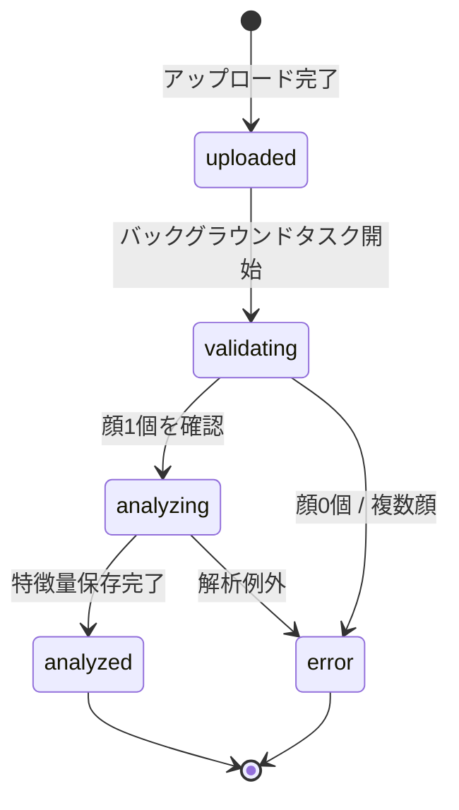

# プロジェクト用語集 (Glossary)

**プロジェクト**: FaceGraph
**更新日**: 2026-03-20

---

## ドメイン用語

プロジェクト固有のビジネス概念・機能に関する用語。

---

### 人物（Person）

**定義**: FaceGraph内で顔画像を紐付ける管理単位。

**説明**: 名前（表示名）のみで登録する。実際の個人と1対1に対応することを想定するが、任意の名前で作成可能。1人物に対して複数の顔画像を登録できる。

**関連用語**: 画像（Image）、人物特徴量（PersonFeature）

**使用例**:
- 「人物Aを登録する」= `POST /api/persons { name: "太郎" }` を実行する
- 「人物を削除する」= 関連する画像・特徴量・比較結果も連鎖削除される

**英語表記**: Person

---

### 画像（Image）

**定義**: 人物に紐付く、顔が写った1枚の写真ファイル。

**説明**: 正面顔1名が写っている必要がある。MinIO（S3互換ストレージ）に保存され、解析パイプラインが自動実行される。顔の数に応じてバリデーションが行われ、ステータスが遷移する。

**関連用語**: 解析ステータス、特徴量（Feature）、解析パイプライン

**使用例**:
- 「画像をアップロードする」= `POST /api/persons/{id}/images` でファイルを送信する
- 「解析済み画像」= `status = "analyzed"` の画像

**英語表記**: Image

---

### 類似度スコア（Similarity Score）

**定義**: 2人の人物の顔がどれだけ似ているかを0〜100%の数値で表したもの。

**説明**: MVPではコサイン類似度を使用。2人の特徴量ベクトル間のコサイン類似度（-1〜1）を0〜100%にスケール変換して出力する。100%に近いほど似ており、0%に近いほど似ていない。

**関連用語**: コサイン類似度、特徴量ベクトル（FeatureVector）

**使用例**:
- 「類似度72%」= 2人の特徴量ベクトル間のコサイン類似度が0.44に相当
- 「スコアが高い」= 顔の幾何学的特徴量が近い

**英語表記**: Similarity Score

---

### 比較（Comparison）

**定義**: 任意の2人物を選択して類似度スコアを算出し、その結果をDBに保存したもの。

**説明**: 同じペア・同じ手法の比較結果はDBにキャッシュされ、再計算なしに返される（`is_valid = true` の場合）。いずれかの人物の画像が変更された場合は無効化（`is_valid = false`）され、次回アクセス時に自動再計算される。

**関連用語**: 比較キャッシュ、無効化（Invalidation）

**使用例**:
- 「比較する」= `POST /api/comparisons { person_a_id, person_b_id }` を実行する
- 「比較が無効化された」= `is_valid = false` になり、次回アクセス時に再計算される

**英語表記**: Comparison

---

### 比較キャッシュ（Comparison Cache）

**定義**: 一度計算した比較結果をDBに保存し、同じペアへの再アクセス時に計算を省略する仕組み。

**説明**: `comparisons` テーブルが比較キャッシュとして機能する。`is_valid = true` のレコードがある場合はキャッシュから返し、`is_valid = false` または未計算の場合は再計算してキャッシュを更新する。

**関連用語**: 無効化（Invalidation）、比較（Comparison）

**英語表記**: Comparison Cache

---

### 無効化（Invalidation）

**定義**: 人物の画像が変更された際に、その人物を含む全比較結果を `is_valid = false` にすること。

**説明**: 画像の追加・削除により特徴量が変化するため、古い比較結果は正確でなくなる。無効化により「古いキャッシュを誤って返す」ことを防ぐ。無効化された比較は次回アクセス時に自動再計算される。

**関連用語**: 比較キャッシュ、is_valid

**使用例**:
- 「画像を削除すると関連比較が無効化される」= `UPDATE comparisons SET is_valid = false WHERE person_a_id = X OR person_b_id = X`

**英語表記**: Invalidation

---

## 技術用語

プロジェクトで使用している技術・フレームワークに関する用語。

---

### MediaPipe Face Mesh

**定義**: Google が開発した、画像から顔のランドマーク座標を検出するMLライブラリ。

**本プロジェクトでの用途**: GPU不要でMac Dockerで動作。正面顔1枚から468点のランドマーク座標（x, y, z）を検出する。解析パイプラインの第1ステップで使用。

**バージョン**: `mediapipe 0.10`

**関連ドキュメント**: `docs/architecture.md`

---

### ランドマーク（Landmark）

**定義**: 顔の特徴点（目頭、鼻尖、口角など）の座標。MediaPipeが検出する。

**説明**: MediaPipe Face Meshは1枚の正面顔から468点のランドマーク座標（x, y, z）を出力する。各点には0〜467のインデックスが割り振られており、例えばインデックス33が左目中心、263が右目中心。

**関連用語**: MediaPipe Face Mesh、特徴量（Feature）

**英語表記**: Landmark

---

### 特徴量（Feature）

**定義**: 顔のランドマーク座標から算出した、距離・角度・比率の数値ベクトル。

**説明**: IPDで正規化された距離特徴量、3点から計算する角度特徴量、比率特徴量の3カテゴリで構成される。顔のサイズ（撮影距離）に依存しない形に正規化されている。DBの `features.raw_vector` カラムに `FLOAT[]` として保存される。

**関連用語**: IPD、ランドマーク（Landmark）、特徴量ベクトル（FeatureVector）

**英語表記**: Feature

---

### 特徴量ベクトル（Feature Vector）

**定義**: 1人物（または1画像）の顔特徴を表すfloatの配列。類似度計算の入力となる。

**説明**: 1画像の特徴量は `features.raw_vector`、複数画像を平均統合した人物単位の特徴量は `person_features.feature_vector` に保存される。コサイン類似度計算はこの `feature_vector` 同士で行われる。

**関連用語**: 特徴量（Feature）、コサイン類似度

**英語表記**: Feature Vector

---

### コサイン類似度（Cosine Similarity）

**定義**: 2つのベクトル間の角度のコサイン値で類似度を測る指標。値域は -1〜1。

**説明**: FaceGraphでは2人の `feature_vector` 間のコサイン類似度を計算し、0〜1にスケール変換して類似度スコアとする。数式: `cos(θ) = (a・b) / (|a| × |b|)`。実装では `(cos + 1) / 2` で 0〜1 に変換、UIでは 0〜100% として表示する。

**関連用語**: 類似度スコア、特徴量ベクトル

**英語表記**: Cosine Similarity

---

### Strategyパターン

**定義**: アルゴリズムを差し替え可能にするデザインパターン。

**本プロジェクトでの適用**: ランドマーク検出（`LandmarkDetector`）、特徴量抽出（`FeatureExtractor`）、類似度計算（`SimilarityCalculator`）の3箇所に適用。`config.yml` の設定値を変えるだけで手法を切り替えられる。

**関連コンポーネント**: `app/services/analysis/detectors/`, `app/services/analysis/extractors/`, `app/services/analysis/calculators/`

**英語表記**: Strategy Pattern

---

## 略語・頭字語

---

### IPD

**正式名称**: Inter-Pupillary Distance（瞳孔間距離）

**意味**: 左目中心から右目中心までの距離。顔特徴量の正規化基準として使用する。

**本プロジェクトでの使用**: 距離特徴量をIPDで割ることで、顔のサイズ（撮影距離）への依存をなくす。`features.raw_vector` の各距離要素はIPD正規化済み。

---

### MVP

**正式名称**: Minimum Viable Product（実用最小限のプロダクト）

**意味**: コア機能のみを実装した最初のリリース版。

**本プロジェクトでの使用**: 「2人の正面顔画像をアップロードし、類似度スコアを1つ表示できる」状態をMVPと定義する。詳細は `docs/product-requirements.md` の「MVPスコープ」を参照。

---

### ER図

**正式名称**: Entity Relationship Diagram（エンティティ関連図）

**意味**: DBのテーブル間の関係を視覚化した図。

**本プロジェクトでの使用**: `docs/functional-design.md` にMermaid形式のER図を記載。5テーブルの関係を定義している。

---

## ステータス・状態

---

### 画像解析ステータス（Image Status）

| ステータス | 意味 | 遷移条件 |
|----------|------|---------|
| `uploaded` | アップロード完了、解析待ち | 画像がMinIOに保存された直後 |
| `validating` | 顔数チェック中 | バックグラウンドタスク開始時 |
| `analyzing` | ランドマーク検出・特徴量抽出中 | 顔が1個と確認された後 |
| `analyzed` | 解析完了 | 特徴量がDBに保存され、person_featuresが更新された後 |
| `error` | 解析失敗 | 顔が0個・複数個・解析例外 |

**状態遷移図**:


---

### 比較結果の有効フラグ（is_valid）

| 値 | 意味 | 発生タイミング |
|----|------|--------------|
| `true` | 有効（キャッシュとして利用可能） | 比較計算完了時 |
| `false` | 無効（次回アクセス時に再計算） | 関連人物の画像が追加・削除された時 |

---

## データモデル用語

---

### persons テーブル

**定義**: 登録人物のマスターテーブル。

**主要フィールド**:
- `id` (UUID): 主キー
- `name` (VARCHAR 100): 表示名

**関連エンティティ**: `images`（1対多）、`person_features`（1対1）、`comparisons`（1対多）

---

### images テーブル

**定義**: アップロードされた顔画像のメタデータテーブル。実ファイルはMinIOに保存。

**主要フィールド**:
- `storage_path`: MinIO上のオブジェクトパス
- `status`: 解析ステータス（上記参照）
- `metadata`: エラー理由等のJSONB

**関連エンティティ**: `persons`（多対1）、`features`（1対1）

---

### features テーブル

**定義**: 画像単位の顔解析結果。ランドマーク座標と特徴量ベクトルを保存。

**主要フィールド**:
- `model_version`: 使用した解析モデルのバージョン（例: `mediapipe_v0.10_distance_ratio_v1`）
- `landmarks`: 468点のランドマーク座標（JSONB）
- `raw_vector`: 正規化済み特徴量ベクトル（FLOAT[]）

**制約**: `image_id` にUNIQUE制約（1画像につき1レコード）

---

### person_features テーブル

**定義**: 複数画像の特徴量ベクトルを統合した人物単位の代表特徴量。

**主要フィールド**:
- `method`: 統合方式（MVP: `average`）
- `feature_vector`: 統合済み特徴量ベクトル（FLOAT[]）
- `image_count`: 統合に使用した画像数

**制約**: `person_id` にUNIQUE制約（1人物につき1レコード）

---

### comparisons テーブル

**定義**: 2人物間の比較結果キャッシュ。

**主要フィールド**:
- `person_a_id` / `person_b_id`: 比較対象の人物UUID
- `similarity_method`: 使用した類似度計算手法
- `score`: 類似度スコア（0.0〜1.0）
- `is_valid`: キャッシュ有効フラグ

**制約**: `(person_a_id, person_b_id, similarity_method)` にUNIQUE制約

---

## 計算・アルゴリズム

---

### IPD正規化（IPD Normalization）

**定義**: 顔パーツ間の距離をIPD（瞳孔間距離）で割り、顔のサイズに依存しない特徴量を得る変換。

**計算式**:
```
正規化距離 = ランドマーク間のユークリッド距離 / IPD
```

**実装箇所**: `backend/app/services/analysis/extractors/distance_ratio.py`

**例**:
```
IPD = 60px のとき、鼻の長さ = 45px → 正規化値 = 0.75
IPD = 120px のとき、鼻の長さ = 90px → 正規化値 = 0.75  ← サイズに依らず同じ
```

---

### 平均統合（Average Aggregation）

**定義**: 1人物が複数画像を持つ場合に、各画像の特徴量ベクトルを要素ごとに平均して代表ベクトルを得る方法。

**計算式**:
```
feature_vector = mean([raw_vector_1, raw_vector_2, ..., raw_vector_n], axis=0)
```

**実装箇所**: `backend/app/services/analysis/aggregator.py`

**例**:
```
画像1: [0.8, 0.3, ...]
画像2: [0.6, 0.5, ...]
平均:  [0.7, 0.4, ...]  ← これが person_features.feature_vector
```

---

### コサイン類似度のスコア変換

**定義**: コサイン類似度の値域（-1〜1）を類似度スコア（0〜1）に変換する式。

**計算式**:
```
score = (cosine_similarity + 1) / 2
score_percent = round(score * 100)  # UIでは 0〜100% として表示
```

**実装箇所**: `backend/app/services/analysis/calculators/cosine.py`

**例**:
```
cos = 1.0  → score = 1.0 → 100%（完全一致）
cos = 0.0  → score = 0.5 →  50%（無相関）
cos = -1.0 → score = 0.0 →   0%（逆方向）
```
