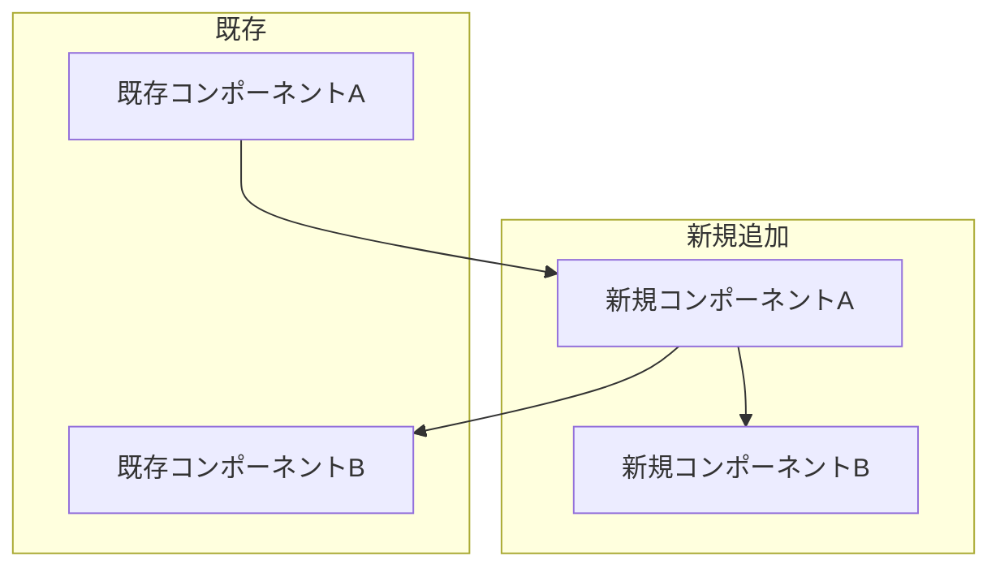
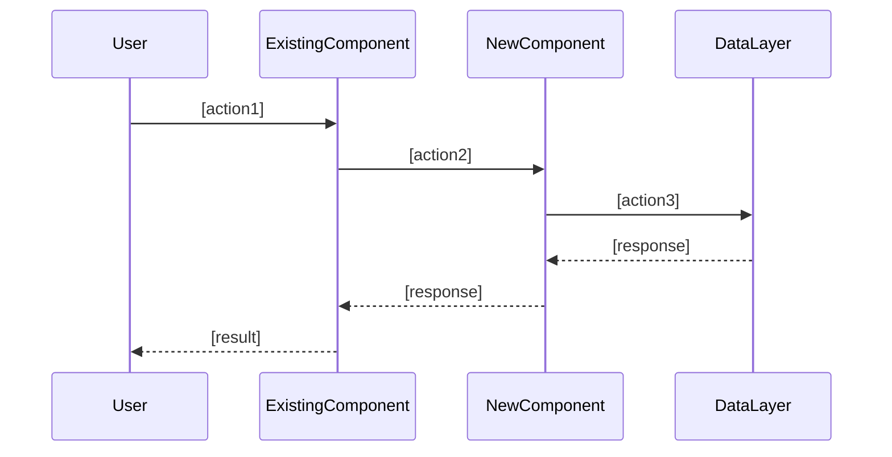

# 機能設計書: [機能名]

## 既存システムとの関係

### 影響を受ける既存コンポーネント

| コンポーネント | 変更内容 | 影響度 |
|--------------|---------|-------|
| [既存コンポーネント1] | [変更内容] | 高/中/低 |
| [既存コンポーネント2] | [変更内容] | 高/中/低 |

### 新規追加コンポーネント

| コンポーネント | 責務 |
|--------------|------|
| [新規コンポーネント1] | [責務] |
| [新規コンポーネント2] | [責務] |

## システム構成図



## データモデル

### 既存モデルへの変更

```typescript
// 変更前
interface ExistingModel {
  id: string;
  existingField: string;
}

// 変更後（差分）
interface ExistingModel {
  id: string;
  existingField: string;
  newField: string;          // 追加
}
```

### 新規モデル

```typescript
interface NewModel {
  id: string;              // UUID
  [field1]: [type];        // [説明]
  [field2]: [type];        // [説明]
  createdAt: Date;
  updatedAt: Date;
}
```

## コンポーネント設計

### [コンポーネント1]

**責務**:
- [責務1]
- [責務2]

**インターフェース**:
```typescript
class [ComponentName] {
  [method1]([params]): [return];
  [method2]([params]): [return];
}
```

**依存関係**:
- [既存コンポーネントX]（既存）
- [新規コンポーネントY]（新規）

## ユースケース

### [ユースケース1]



## API設計（該当する場合）

### [エンドポイント1]

```
POST /api/[resource]
```

**リクエスト**:
```json
{
  "[field]": "[value]"
}
```

**レスポンス**:
```json
{
  "id": "uuid",
  "[field]": "[value]"
}
```

## エラーハンドリング

| エラー種別 | 処理 | ユーザーへの表示 |
|-----------|------|-----------------|
| [種別1] | [処理内容] | [メッセージ] |
| [種別2] | [処理内容] | [メッセージ] |

## テスト戦略

### ユニットテスト
- [対象1]
- [対象2]

### 統合テスト
- [シナリオ1]
- [シナリオ2]

## セキュリティ考慮事項

- [考慮事項1]: [対策]
- [考慮事項2]: [対策]

## パフォーマンス考慮事項

- [考慮事項1]: [対策]
- [考慮事項2]: [対策]
